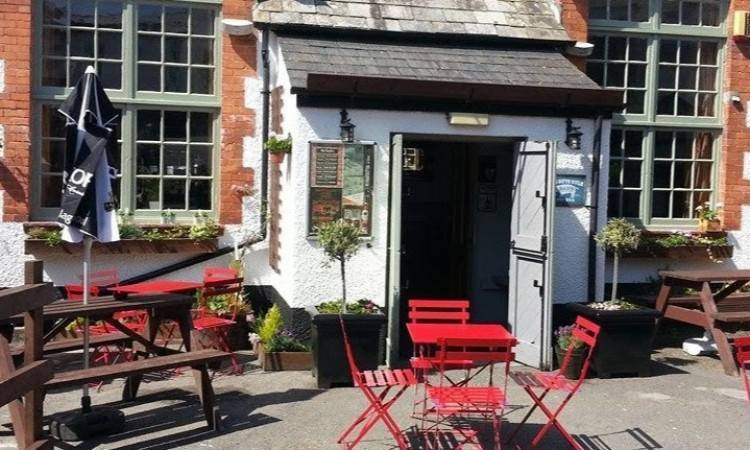

```{r setup, echo=FALSE}
knitr::opts_chunk$set(echo = TRUE)
#source('mapsassignment.R')
```

##  The Town of Bude

Bude is a small seaside resort town in north Cornwall, England, UK,  
in the civil parish of Bude-Stratton and at the mouth of the River Neet (also known locally as the River Strat). It is sometimes formerly known as Bude Haven. It lies southwest of Stratton, south of Flexbury and Poughill, and north of Widemouth Bay and is located along the A3073 road off the A39. Bude is twinned with Ergué-Gabéric in Brittany, France. Bude's coast faces Bude Bay in the Celtic Sea, part of the Atlantic Ocean. The population of the civil parish can be found under Bude-Stratton.


##  There’s a lot to love about Bude! 

With a laidback allure all of its own, and so much to see and do, we have something for everyone. From romantic whiskaways to fun-fuelled family holidays, it’s all here, where Cornwall begins and everyday cares melt away.  Bude has been named as the Best UK Coastal Resort for three consecutive years, winning a section of Gold, Silver and Bronze awards in the British Travel Awards. Below are some of the best locations for a vacation getway. 





